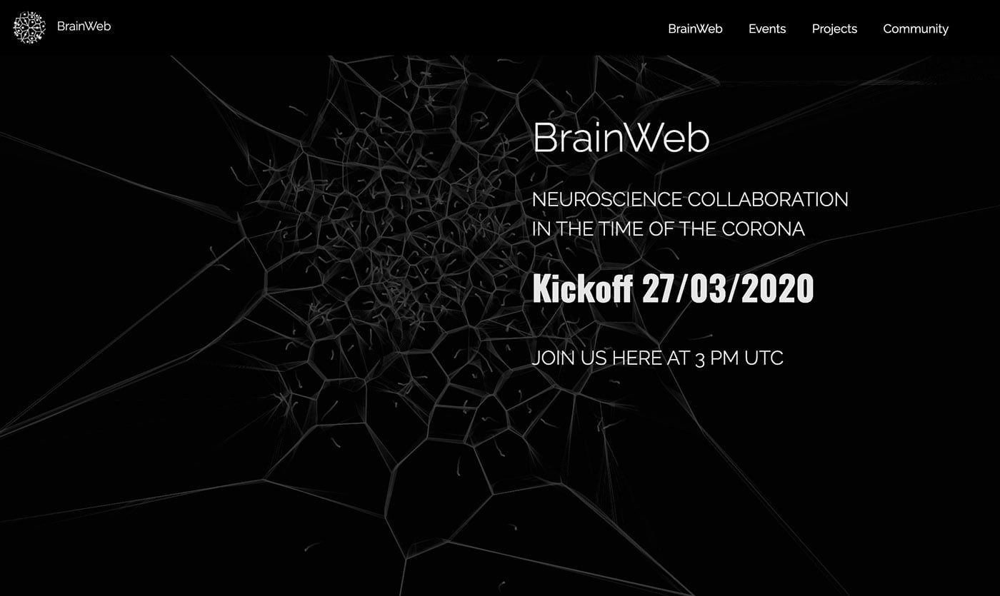
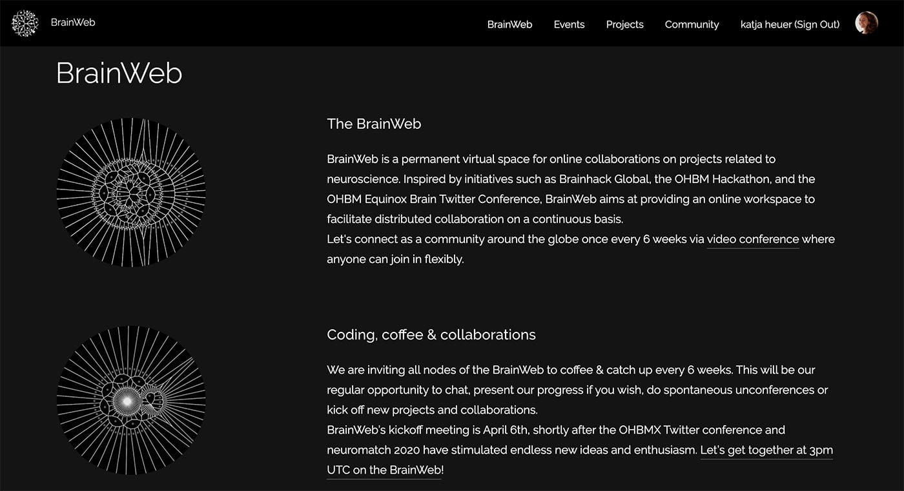
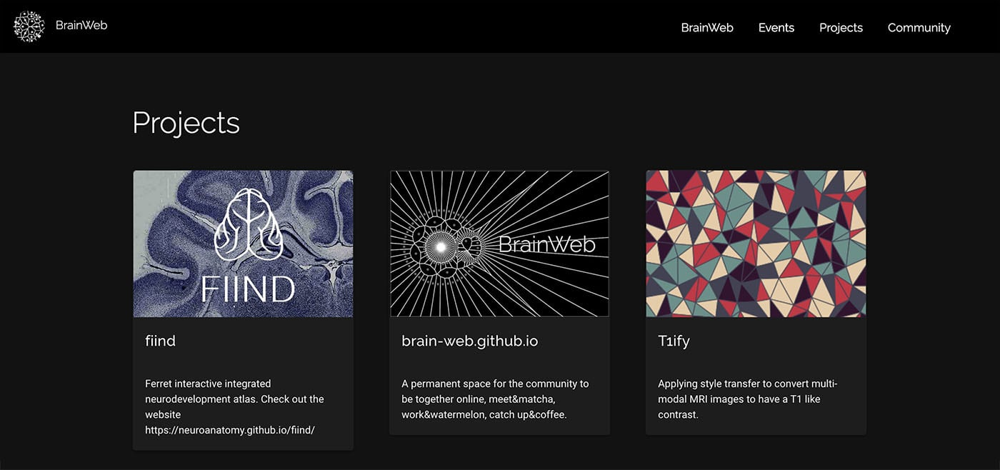

<!--(https://github.com/brain-web/brain-web.github.io/raw/master/images/readme/brainweb_card.jpg)-->

Join our channel on  

<!-- TOC -->

- [brain-web.github.io](#brain-webgithubio)
  - [Propose a project](#propose-a-project)
    - [You are self conscious about the quality of the code in your project?](#you-are-self-conscious-about-the-quality-of-the-code-in-your-project)
    - [You think that you won't be able to lead a team of several people to work on your project?](#you-think-that-you-wont-be-able-to-lead-a-team-of-several-people-to-work-on-your-project)
    - [Presenting your project](#presenting-your-project)
    - [Remove a project](#remove-a-project)
  - [How to help](#how-to-help)
    - [Our wish list](#our-wish-list)
    - [Skills required](#skills-required)
    - [Organization of the website](#organization-of-the-website)
      - [Network vizualization](#network-vizualization)
    - [How to run the website locally](#how-to-run-the-website-locally)
    - [Suggesting changes](#suggesting-changes)
  - [Getting in touch](#getting-in-touch)

<!-- /TOC -->

# brain-web.github.io
A permanent space for the community to be together online, meet&amp;matcha, work&amp;watermelon, catch up&amp;coffee.

See you in our next community call! :)

<!-- 

 -->

## Propose a project

If you want your project to be listed on the BrainWeb project page all you need to do is to create a repository on GitHub and to add `BrainWeb` as a topic to the repo. It will then automatically be featured in the BrainWeb project pool on the website.  

Each project appears with the repo's title and description, and is linked to the GitHub repo. We will eventually add more info, like contributors, number of stars etc. If you do not have an image in your README, your project will be shown with a randomly generated pattern image.
These patterns are lovely, but in case you'd prefer an image that shows what the project is about, here are our recommended guidelines:   

   1. Create an image that shows in small format of dimensions 300px x 200px what you'd like to show --> save it as `yourproject_card.jpg` (small format is important so it doesn't slow BrainWeb website down as number of projects will grow.  

   2. Add an image to your repo.

   3. Click on the image to get its link (right click on image --> open in new tab --> copy browser url).

   4. paste this link into your README file (either visible so like `` or invisible as a comment (like this <!--(https://github.com/brain-web/brain-web.github.io/raw/master/images/readme/brainweb_card.jpg)--> (which we recommend as we create a small image for the card and don't show this one in the readme, but show a bigger image there :)  

Sidenote: The comment may not be visible depending on your Markdown renderer. You could open this README in `Raw` mode on GitHub to see the comment.

   5. Your image will automatically show in the BrainWeb webpage   

Note: BrainWeb takes the first linked image it finds in your README file. So you could potentially make the small version invisible at the top of your README, and add a link to a larger image  for your README itself.

### You are self conscious about the quality of the code in your project?

You have this nice project you are working on, but you are keeping repo private because you think it is poorly coded.

We get it. Many of us never got the training on how to code properly.

Get in touch with us on [mattermost](https://mattermost.brainhack.org/brainhack/channels/brainweb) and we could arrange to help you go through your code and gain enough confidence to make your code public and this way find potential new collaborators.

### You think that you won't be able to lead a team of several people to work on your project?

Yup. Some of us have been there too. Come and [chat with us](https://mattermost.brainhack.org/brainhack/channels/brainweb), and we will tell you what we learned and how we can help you get started with this.

### Presenting your project

At our regular meetings, you will get the chance to present your project to other attendees. so here are some guidelines for our project pitch.

   - keep it short (definitely less than 5 minutes). Yes this is short but there will be time at every meeting for people who are interested to come and ask you questions if they want to know more.
   - if you are too shy, you can record your pitch beforehand if you want or get in touch with us if you want some one on one feedback.
   - tell us why you are passionate about this project
   - mention what concrete goals you want to achieve through this hackathon
   - let people know what type of skills (coding or otherwise) you are looking for. You can get some inspiration from this [template](https://github.com/OpenMRBenelux/openmrb2020-hackathon/blob/master/.github/ISSUE_TEMPLATE/hackathon-project-template.md)

### Remove a project

If you remove the `BrainWeb` topic from your repo, then it will no longer appear on the BrainWeb project page.

## How to help

### Our wish list

Below are some of the ideas that we thought we could implement in this project. Maybe you want to help us make them real. Or maybe you have your own suggestionss, so come and chat with us on [mattermost](https://mattermost.brainhack.org/brainhack/channels/brainweb) or open an issue.

- [ ] create a blog with regular posts ; eventually turn it into a newsletter where we present each other's projects
- [ ] improve the network visualization on the community page (add filtering options based on skills, vizualize only sub-networks, select users by color-coding, add a chat...)
- [ ] implement some matching process between the skills required for a project and the skills of the users in the community BrainWeb
- [ ] create a twitter bot to let every know that we have a new project listed on the BrainWeb

### Skills required

If you want to help with the website of the BrainWeb project you will need to be familiar with a bit of:
- git and github
- html
- css

Moreover some of the more advanced functions require some knowledge of one or several of the following:
- Firebase
- Javascript
- Quasar
- Vue.js
- D3

### Organization of the website

We use the google Firebase as the database for our users. It allows us to recreate on the fly the BrainWeb network on the community page every time a new skill is added.

#### Network vizualization

The network vizualization is implemented in the community page in `community/index.html`.

We use the D3 library for the visualization of the network. It allows for quick and easy changes in visualizations.

There are currently two pruning functions and allow for a maximum of 10 colors to be implemented in the graph. We do a heavier pruning to actually link the dots and only links to the 3 people with most skills on common to a given dot.

### How to run the website locally

   1. Fork & Clone the BrainWeb repo

   2. Run an http server from inside that directory (we use https://www.npmjs.com/package/http-server)

Firebase only accept request from a known website. `Localhost` was added as a known: if this is removed then each user will have to set up their own firebase to run it locally.

In practice this means:

- **CAREFUL 1**: you’ll be connected to the official DB!!! For testing, better change BrainWeb for BrainWeb2 in line 207, file `brain-web/community/index.html` (“const circleName = "BrainWeb2";”)

- **CAREFUL 2**: you’ll be using Roberto’s free Firebase account (which is very limited). If you really want to do some have DB-related stuff, better to open your own free Firebase account.

### Suggesting changes

If you want to propose some changes: come and chat with us on [mattermost](https://mattermost.brainhack.org/brainhack/channels/brainweb) or open an issue.

Then you can make a new branch before implementing your changes and open a pull request, so that we can see it in action, and have the possibility to suggest adaptations before merging the pull request into the master branch.

## Getting in touch

If you have any question or some information is missing in this readme, get in touch via [mattermost](https://mattermost.brainhack.org/brainhack/channels/brainweb) or feel free to open an issue.
